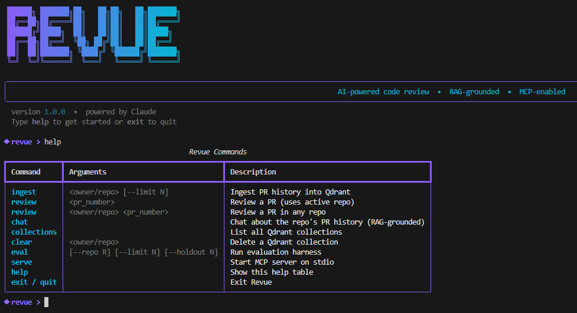

# Revue



An AI-powered code review agent that retrieves semantically similar past PRs, relevant code patterns, and historical review comments from a repository's history, then synthesizes a grounded, cited code review for any incoming PR diff.

Exposed as both an interactive CLI REPL and an MCP server — callable directly from Claude Code or Cursor mid-session.

---

## Architecture

```
GitHub Repo
     │
     ▼
┌─────────────────────────────────────────────────────┐
│                  INGESTION PIPELINE                 │
│  GitHubFetcher → Chunker → Embedder → Qdrant       │
│  (PR history: metadata, diffs, review comments)    │
└─────────────────────────────────────────────────────┘
                         │
              (stored in Qdrant vector DB)
                         │
     ┌───────────────────▼─────────────────────┐
     │           AGENT PIPELINE                │
     │                                         │
     │  1. Planner  ──► sub-queries, filters   │
     │       │                                 │
     │  2. Executor ──► vector search +        │
     │       │          cross-encoder rerank   │
     │       │                                 │
     │  3. Synthesizer ──► grounded review     │
     │       │             with [PR #N] cites  │
     │       │                                 │
     │  4. Critic   ──► hallucination check    │
     │                  + citation cleanup     │
     └─────────────────────────────────────────┘
                         │
               Verified Markdown Review
                    ┌────┴────┐
                    ▼         ▼
              Revue REPL    MCP Server
                           (Claude Code / Cursor)
```

---

## Tech Stack

| Component       | Technology                                   |
|-----------------|----------------------------------------------|
| Language        | Python 3.11+                                 |
| GitHub API      | PyGithub                                     |
| Embeddings      | sentence-transformers `all-MiniLM-L6-v2`     |
| Vector DB       | Qdrant (local via Docker)                    |
| Reranking       | `cross-encoder/ms-marco-MiniLM-L-6-v2`       |
| Agent LLM       | Claude `claude-haiku-4-5-20251001`           |
| MCP Server      | official `mcp` Python SDK                   |
| CLI             | rich                                         |
| Config          | python-dotenv                                |

---

## Setup

### 1. Clone and install

```bash
git clone https://github.com/vineelkondapalli/pr-review-agent.git
cd pr-review-agent

conda create -n pr-review-agent python=3.11
conda activate pr-review-agent
pip install -r requirements.txt
pip install -e .
```

`pip install -e .` registers the `revue` command so you can launch the REPL from anywhere.

### 2. Start Qdrant

```bash
docker compose up -d
```

Qdrant dashboard: http://localhost:6333/dashboard

### 3. Configure environment

```bash
cp .env.example .env
# Edit .env and fill in your tokens:
#   GITHUB_TOKEN=ghp_...
#   ANTHROPIC_API_KEY=sk-ant-...
```

---

## Usage

Launch the REPL:

```bash
revue
```

```
 ██████╗ ███████╗██╗   ██╗██╗   ██╗███████╗
 ██╔══██╗██╔════╝██║   ██║██║   ██║██╔════╝
 ██████╔╝█████╗  ██║   ██║██║   ██║█████╗
 ██╔══██╗██╔══╝  ╚██╗ ██╔╝██║   ██║██╔══╝
 ██║  ██║███████╗ ╚████╔╝ ╚██████╔╝███████╗
 ╚═╝  ╚═╝╚══════╝  ╚═══╝   ╚═════╝ ╚══════╝

◆ revue >
```

### Commands

| Command | Arguments | Description |
|---|---|---|
| `ingest` | `<owner/repo> [--limit N]` | Ingest PR history into Qdrant |
| `use` | `<owner/repo>` | Set active repo (must already be ingested) |
| `review` | `<pr_number>` | Review a PR using the active repo |
| `review` | `<owner/repo> <pr_number>` | Review a PR in any repo |
| `chat` | `[message]` | RAG chat about the repo's PR history |
| `collections` | | List all Qdrant collections |
| `clear` | `<owner/repo>` | Delete a Qdrant collection |
| `eval` | `[--repo R] [--limit N] [--holdout N]` | Run evaluation harness |
| `serve` | | Start MCP server on stdio |
| `help` | | Show command reference |
| `exit` / `quit` | | Exit Revue |

### Typical session

```
◆ revue > ingest encode/httpx --limit 100
✓ Ingested 100 PRs (312 chunks, 312 new) from encode/httpx

◆ revue [httpx] > review 1234
...renders markdown review with verdict + citations...

◆ revue [httpx] > chat
  chat > What's the most common review pattern in this repo?
...streams answer grounded in PR history...

◆ revue [httpx] > use encode/httpx
✓ Active repo set to encode/httpx.
```

### Re-ingesting is idempotent

Chunks are keyed by SHA-256 of `repo:pr:type:file` — re-running `ingest` skips existing chunks and only upserts new ones. GitHub responses are also cached under `cache/` so repeated runs don't hit the API.

### Session state

Once a repo is ingested (or `use`d), it becomes the **active repo** for the session. The prompt updates to show it: `◆ revue [httpx] >`. Commands `review`, `chat`, and `eval` use the active repo automatically.

---

## Chat

The `chat` command drops into a multi-turn conversational interface grounded in the ingested PR history:

```
◆ revue [httpx] > chat
  chat > What is the most common review comment in this repo?
  chat > How does this codebase handle authentication?
  chat > Have there been any PRs about rate limiting?
```

- Responses stream live to the terminal via `rich.live.Live`
- Each answer includes a **Context Sources** panel listing cited PR numbers and relevance scores
- Type `reset` to clear conversation history, `exit` or `back` to return to the main REPL

---

## MCP Integration

### Claude Code

Add to your Claude Code MCP config (`~/.claude/claude_desktop_config.json` or `.mcp.json`):

```json
{
  "mcpServers": {
    "pr-review": {
      "command": "python",
      "args": ["main.py", "serve"],
      "cwd": "/absolute/path/to/pr-review-agent",
      "env": {
        "PYTHONPATH": "/absolute/path/to/pr-review-agent"
      }
    }
  }
}
```

Then in Claude Code, the `review_pr` tool is available:

> "Review this PR diff for owner/repo"

Tool signature:
```
review_pr(diff: str, repo: str) -> str
```

### Cursor

Add the same JSON block under `mcpServers` in your Cursor MCP settings.

---

## Evaluation

```bash
# From the REPL
◆ revue [httpx] > eval --limit 200 --holdout 30

# Or directly
python eval/evaluate.py --repo owner/repo --holdout 30 --limit 200
```

Ingests all but the last 30 PRs, then runs the full pipeline on each holdout PR and reports:

| Metric | Description |
|---|---|
| Retrieval Recall | Fraction of human-referenced PRs that appear in the top-20 chunks |
| Citation Accuracy | Whether the Critic found no hallucinated citations |
| Review Relevance | LLM-as-judge score (1–5) for specificity and usefulness |

---

## Project Structure

```
pr-review-agent/
├── ingestion/
│   ├── github_fetcher.py   # PyGithub wrapper with caching + concurrency
│   ├── chunker.py          # metadata / diff / review_comment chunks
│   └── embedder.py         # sentence-transformers + idempotent upsert
├── retrieval/
│   ├── vector_store.py     # Qdrant client wrapper
│   └── reranker.py         # cross-encoder reranking + dedup
├── agents/
│   ├── planner.py          # Claude → structured sub-queries (JSON)
│   ├── executor.py         # multi-query retrieval + rerank
│   ├── synthesizer.py      # Claude → grounded markdown review
│   ├── critic.py           # Claude → citation verification + cleanup
│   └── chat.py             # multi-turn RAG chatbot with streaming
├── mcp_server/
│   └── server.py           # MCP tool: review_pr(diff, repo)
├── eval/
│   └── evaluate.py         # holdout eval harness
├── main.py                 # Revue REPL entrypoint
├── pyproject.toml          # revue entry point (pip install -e .)
├── docker-compose.yml      # Qdrant service
└── requirements.txt
```
